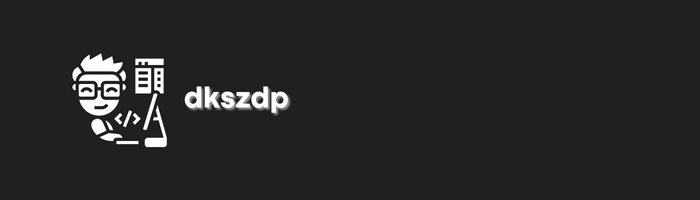

# Hola, bienvenido a mi perfil!

Me llamo **David** aka **dkszdp**, y soy estudiante de ***Desarrollo de Aplicaciones Web***. Creador de **DKSZP-ORG**

  

## Estadísticas 📊

## Trofeos 🏆

## Habilidades 🎓

                   

## Redes Sociales 📷

